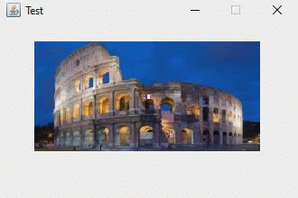
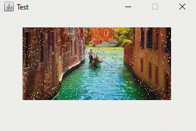
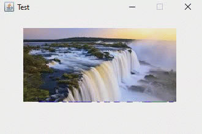

# Random-Animated-Images-Segue

This program picks a random animation and scenery. Clicking on the image generates a new random animation.

## Animated Segues

| Animated Segue | Name           | Description
|----------------|----------------|-------------------------------------
|         | `PixelDissolveEffect`     | Cross-dissolve from source to destination by randomly replacing source pixels with destination pixels.
|           | `CheckerboardEffect`      | Destination image appears over the source in a 8x8 matrix.
|                       | `BlindsEffect`            | Destination appears in "louvered" horizontal stripes.
|               | `ScrollLeftEffect`        | Scroll from right to left.
|             | `ScrollRightEffect`       | Scroll from left to right.
|                   | `ScrollUpEffect`          | Scroll from bottom to top.
|               | `ScrollDownEffect`        | Scroll from top to bottom.
|                   | `WipeLeftEffect`          | Slides the destination image over the source from right to left.
|                 | `WipeRightEffect`         | Slides the destination image over the source from left to right.
|                       | `WipeUpEffect`            | Slides the destination image over the source from bottom to top.
|                   | `WipeDownEffect`          | Slides the destination image over the source from top to bottom.
|                     | `ZoomOutEffect`           | The destination image expands over the source in a rectangle aperture.
|                       | `ZoomInEffect`            | The source image collapses over the destination in a rectangle aperture.
|                   | `IrisOpenEffect`          | The destination image expands over the source in a circular aperture.
|                 | `IrisCloseEffect`         | The source image collapses over the destination in a circular aperture.
|           | `BarnDoorOpenEffect`      | The source image is split horizontally and each side slides out left/right to expose the destination.
|         | `BarnDoorCloseEffect`     | The destination image slides in the from the left/right obscuring the source image.
|       | `ShrinkToBottomEffect`    | The source image shrinks downward exposing the destination.
|             | `ShrinkToTopEffect`       | The source image shrinks upward exposing the destination.
|       | `ShrinkToCenterEffect`    | The source image shrinks from the center of the screen exposing the destination.
| | `StretchFromBottomEffect` | The destination image grows from the bottom obscuring the source underneath it.
|       | `StretchFromTopEffect`    | The destination image grows from the top obscuring the source underneath it.
| | `StretchFromCenterEffect` | The destination image grows from the center of the screen obscuring the source underneath it.
|                         | `PlainEffect`             | A no-op transition that simply renders the source image.

## Previews

 
  
